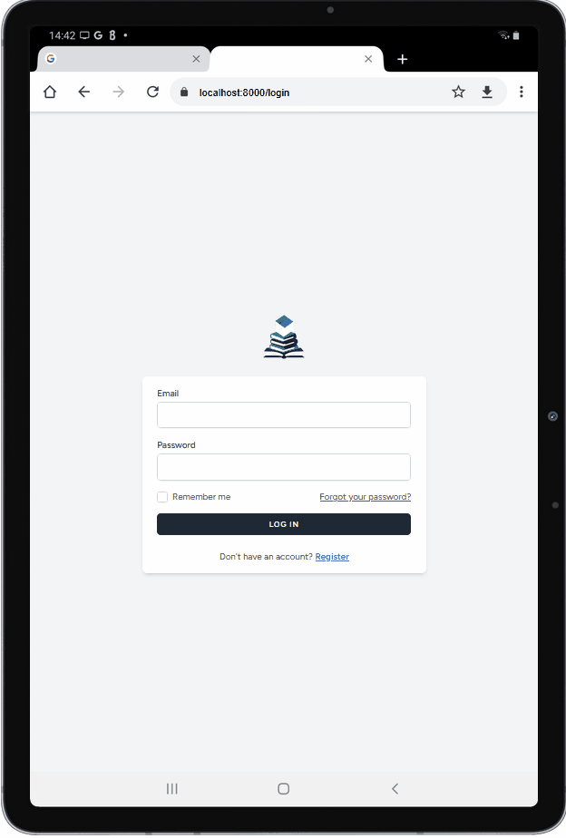

# Book Management System



## 📖 Project Overview

This **Book Management System** was developed as part of the assessment task for the PUSC Web Developer recruitment. The application allows users to register, log in, and securely manage their personal book collections. Its core functionality includes complete CRUD (Create, Read, Update, Delete) operations, ensuring that each user can only access and modify their own book data.

This project was built with a focus on Laravel best practices, including the use of a Seeder for sample data, Policies for authorization, and a clean, responsive interface.

## 🛠️ Tech Stack & Features

### Technology Stack
* **Back-End**: Laravel 11 (PHP Framework)
* **Front-End**: Blade, Tailwind CSS, JavaScript (via Vite)
* **Database**: MySQL

### Core Features
* **Secure Authentication**: A secure registration and login system powered by Laravel Breeze.
* **Book Management (CRUD)**: Users can add, view, edit, and delete their book data.
* **Data Privacy**: Each user can only see and manage their own book collection.
* **Search Functionality**: Allows users to easily search for books by title or author.
* **Pagination**: The book list is automatically divided into pages for better performance.
* **Sample Data**: Comes equipped with a database seeder that provides 1 test user account and 20 sample books for easy testing.

## 🚀 Installation Guide

Here are the steps to run this project locally.

1.  **Clone the Repository**
    ```bash
    git clone [YOUR_REPOSITORY_URL]
    cd BookManagementSystem
    ```

2.  **Install Dependencies**
    ```bash
    composer install
    npm install
    ```

3.  **Setup Environment**
    * Copy the `.env.example` file to `.env`.
        ```bash
        cp .env.example .env
        ```
    * Generate a new application key.
        ```bash
        php artisan key:generate
        ```
    * Open the `.env` file and configure your database credentials (DB_DATABASE, DB_USERNAME, DB_PASSWORD).

4.  **Run Migrations & Seeder**
    * This command will create all database tables and populate them with sample data.
    ```bash
    php artisan migrate:fresh --seed
    ```

5.  **Compile Front-End Assets**
    ```bash
    npm run dev
    ```

6.  **Run the Server**
    * Open a new terminal and run the Laravel development server.
    ```bash
    php artisan serve
    ```
    * The application is now accessible at `http://127.0.0.1:8000`.

## 🧪 Test Account

To facilitate the review process, you can log in directly using the account provided by the seeder:

-   **Email**: `test@example.com`
-   **Password**: `password`

---
